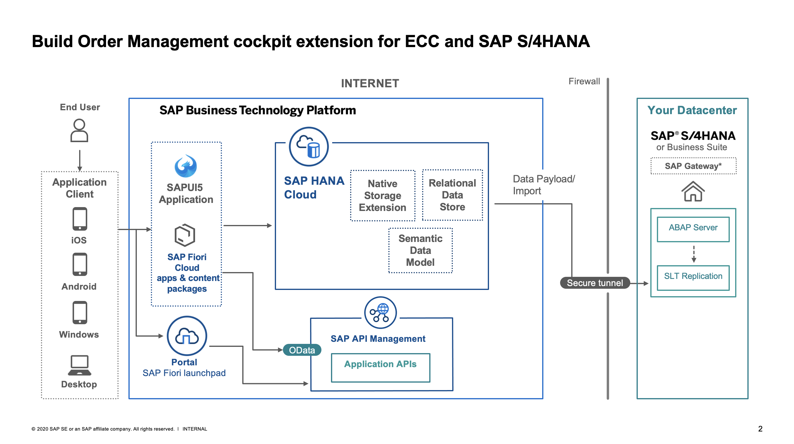

# Integrated Order Management Cockpit - BTP Use Case

## Description
Optimize and streamline purchase and sales order management to deal with delayed and escalated orders. Consolidate disjointed systems and tools, increase cross-team visibility, and reduce the duplication of work. End-to-end and real-time visibility into sales and purchase orders. Collaboration of procurement, customer service, and subject matter experts to handle material delays, escalations, and other issues.

## Solution Architecture

## Challenges
* Sales Person (at branch) and Procurement(center) do not have single source of truth while resolving material escalations.
* Duplicate and Reduntant work done by many parties in resolving escalated material issues causes further delays at customer.
* Current of using several 3rd party systems and traditional communication methods (phone/email) are not helping with the situation.

## Solution
* An integrated order management cockpit that provides end to end visibility into sales and purchase orders with a centralized cockpit where colleagues from procurement, customer service, and application engineering collaborate to handle material delays, escalations, and other issues.
* The solution is built as an extension to the ECC on the SAP Cloud Platform integrating data from ECC and leveraging SAP Hana Cloud for data modeling and interfacing capabilities.

## Requirements
* Hana cloud instantiated on SAP BTP Subaccount (Semantic Models to map data Imported from EDW HANA (side car) , also targets for replicated/federated data in production)
* Backend Server (deployed on App runtime) on SAP BTP subaccount
* Frontend / SAP Open UI5 based application deployed on SAP BTP subaccount

## Download and Installation
* [Setup of a SAP Business Technology Platform Account using Boosters](./mission/btp-setup/README.md)
* [Configure and Deploy Example Application](./mission/configure-and-deploy/README.md)

## Limitations
This example contains no known limitations.

## Known Issues
This example contains no known issues.

## How to obtain support
This project is provided "as-is" with no expectation for major changes or support.

[Create an issue](https://github.com/SAP-samples/btp-extensions-unified-order-management/issues) in this repository if you find a bug or have questions about the content.
 
For additional support, [ask a question in SAP Community](https://answers.sap.com/questions/ask.html).

## License
Copyright (c) 2021 SAP SE or an SAP affiliate company. All rights reserved. This project is licensed under the Apache Software License, version 2.0 except as noted otherwise in the [LICENSE](LICENSES/Apache-2.0.txt) file.
