# Setup of a SAP Business Technology Platform Account using Boosters
## Introduction

For running the Inventory of Management mission you will need the following services in your SAP Business Technology Platform (BTP) account.

* Cloud Foundry Runtime
* SAP HANA Cloud

The entitlement differs for the pricing option of your account:

**Consumption-based SAP BTP Account:**
No entitlement necessary. Be sure that you have enough credits to run the services.

**Subscription-based SAP BTP Account:**
You have to create entitlements for the services above - [see also Entitlements and Quotas](https://help.sap.com/viewer/df50977d8bfa4c9a8a063ddb37113c43/Cloud/en-US/38ecf59cdda64150a102cfaa62d5faab.html#loio363f0f68f9704830ac65c87a2562559b).

[Check the costs with the SAP BTP Estimator Tool](https://www.sap.com/products/business-technology-platform/estimator-tool.html?blueprintId=d3a7926e-61a4-4902-ae00-e952fd883930)

**Booster:**

The setup could be done for each service individually. To simplify the setup process, SAP has introduced Boosters. Boosters are a collection of wizards that provides functionalities for specific scenarios to automate and speed-up the installation and configuration process of a SAP BTP sub-account. This also includes the user management with the mapping of the respective administrator and developer roles.

Before running the booster please check for which regions and infrastructures the services are available - [see SAP BTP Regions and Service Portfolio ](https://help.sap.com/doc/aa1ccd10da6c4337aa737df2ead1855b/Cloud/en-US/3b642f68227b4b1398d2ce1a5351389a.html) - unfortunately the booster is not able to check this in advance, so it will fail when you select a region where a service is not available.

**Persona:** Cloud Administrator (SAP BTP)

**Abbreviation:** SAP Business Technology Platform = SAP BTP

## Step-by-step

### A: Run the Booster

1. Start the Booster
   Login to your global SAP BTP account.
   1. Select Boosters in the SAP BTP Account menu.
   2. Select the Booster "Prepare an Account for Development"

   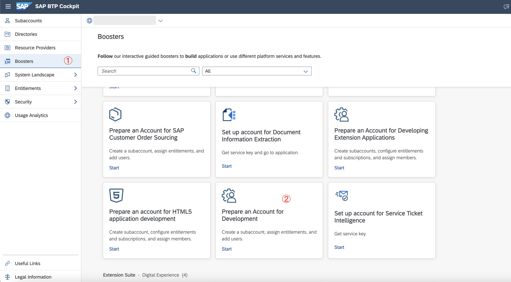

2. Booster Overview

   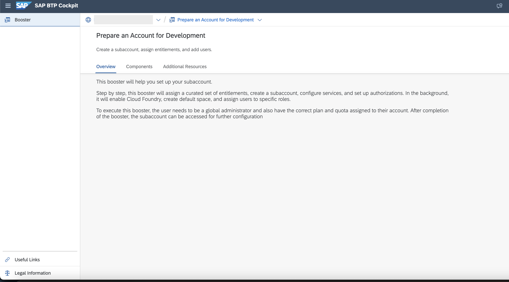

3. Select Components to get an overview of them. Press Start

   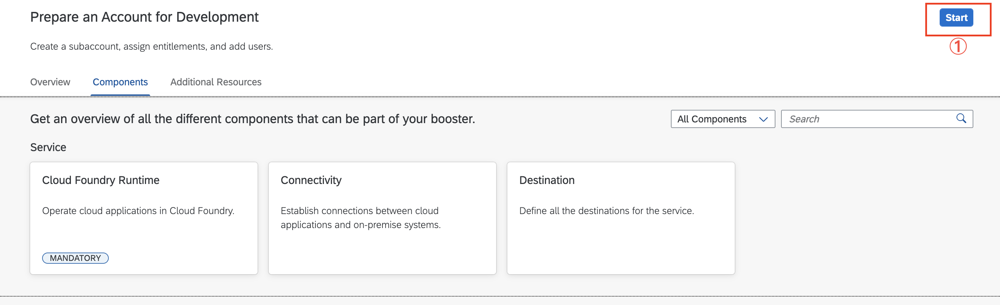

4. Check Prerequisites. If Ok press Next - otherwise check
   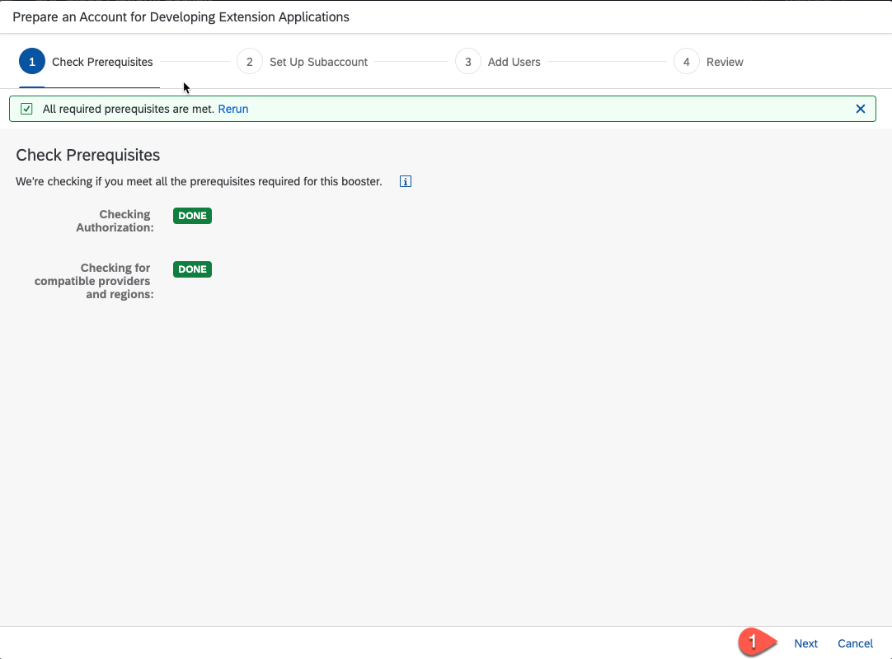

5. Setup Subaccount

   You find the list of the services that will acctivated by the Booster. For this mission the **Connectivity** and the **Destination** are not used in this  mission - therefore you can remove them.

   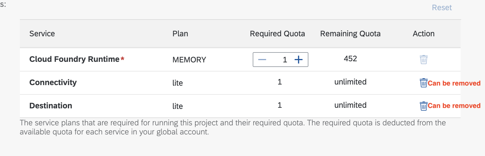

   >By using a subscription-based SAP BTP account you have to set the quota of the **Cloud Foundry Runtime** to 3
   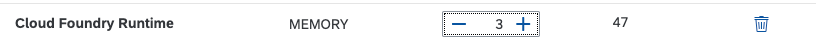

    1. In the sub section enter a meaningful Subaccount name - in general it reflects the organisation of your team etc.
    2. Select your Provider
    3. Select the Region
    4. Enter a meaningful Org Name
    5. Enter a space name - this should reflect the name of your project
    6. Press Next   

   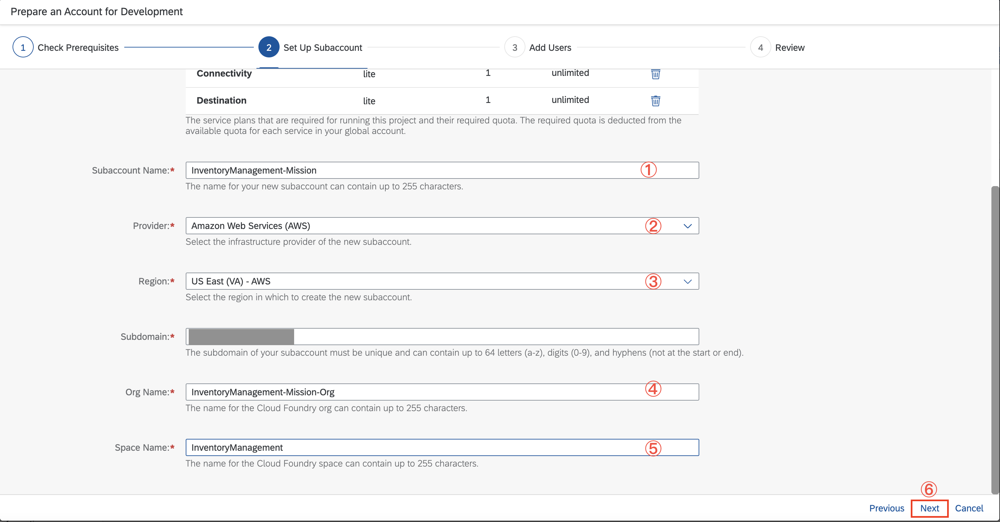

6. Add User
   1. Enter the User ID (mail address) of all administration users
   2. Enter the User ID (mail address) of all development users
   3. Press Next

   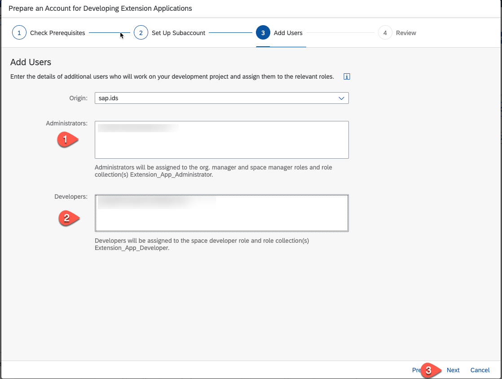

7. Review your settings and press Finish

   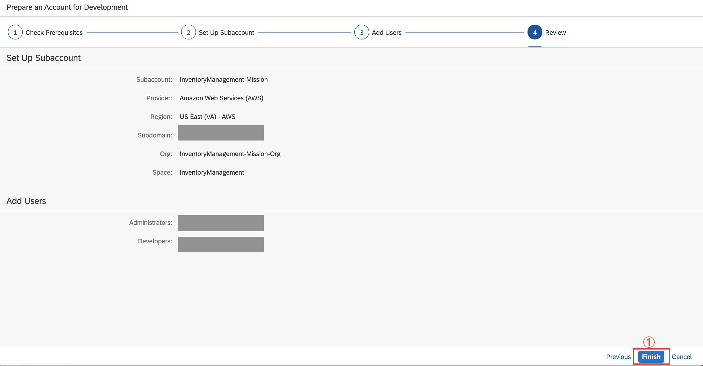

8.  Check the progess - all sections should get green

    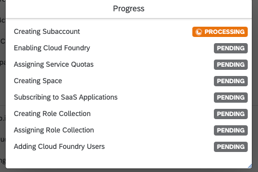

9. If you succeed navigate to the new Subaccount.

    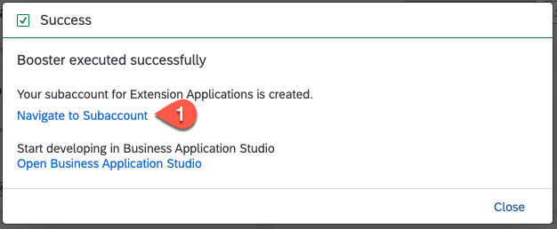

10. Check your subaccount:

    Go to **Instances and Subscriptions** and select the **Subscription** tab - check if the following environment is enabled:
    * Cloud Foundry Runtime

    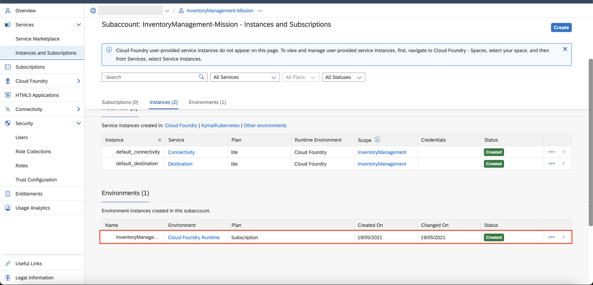

### B: Create a SAP HANA Service Instance

For this mission SAP HANA Cloud for SAP BTP is necessary. Use the following steps for activating it:

1. Select Services - Under your subaccount, select "**Service Marketplace**" and click on the tile '**SAP HANA Cloud**'. If you do not see the 'SAP HANA Cloud' Tile, click 'Entitlements' and click on 'Configure Entitlements and then click 'Add Service Plans' and assign the 'SAP HANA Cloud' service with 'hana' service plan. If you don't have permission to add the entitlement, please contact your administrator.

    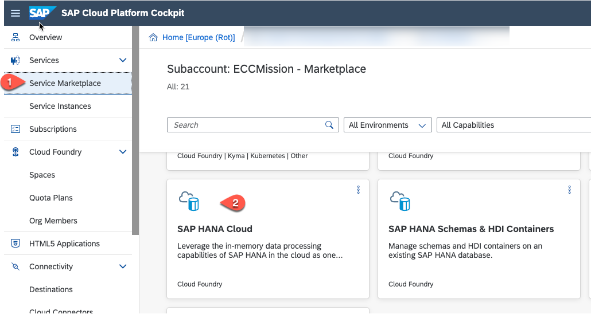

2. Select **Create**.

    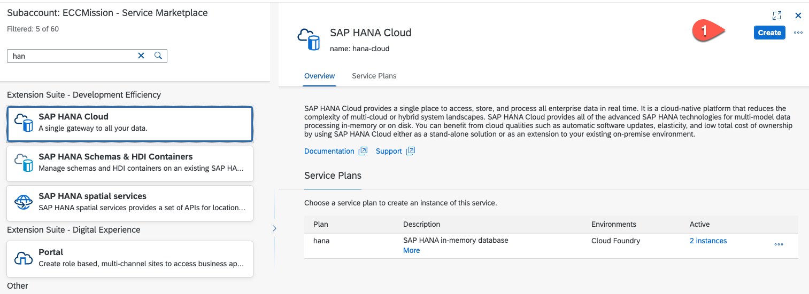

3. In the "New Instance" screen select
    * Service = SAP HANA Cloud
    * Service Plan = Hana
    * Runtime Environment = Cloud Foundry
    * Space = the space you have created with the Booster

    click on the link **here** to create a Database first before creating an instance.

    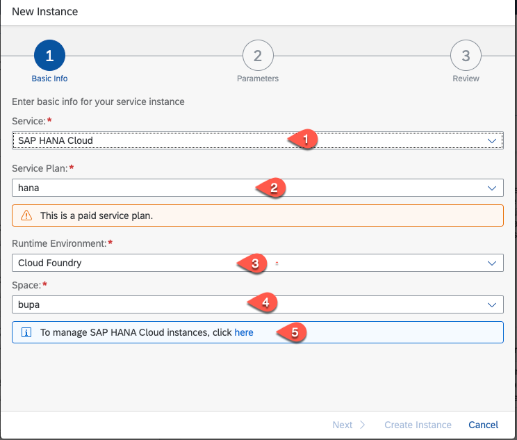

4. Click the button 'Create Database'.

    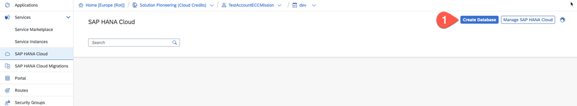

5.  Enter an 'Instance Name','Description' and 'Password'. if everything is correct then the "Step 2" button appear - click on it.

    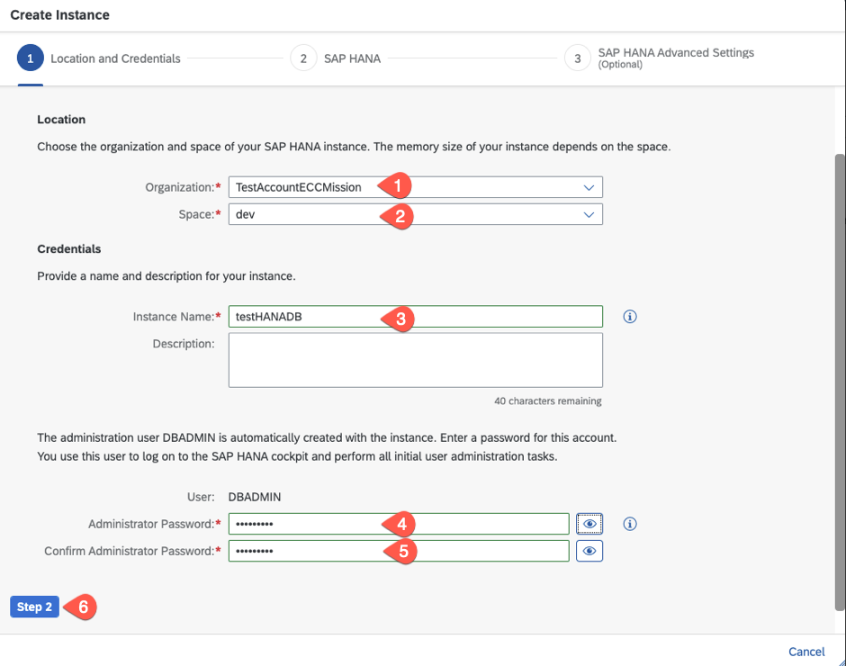

6.  Here you can setup the size of the SAP HANA Cloud instance - for the mission you can keep the minimum settings - click on "Step 3"

    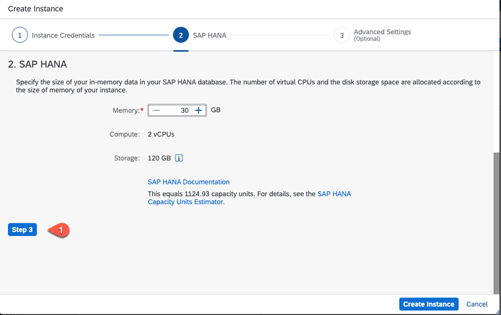

7.  Keep the Advanced Settings and click on "Create Instance"

    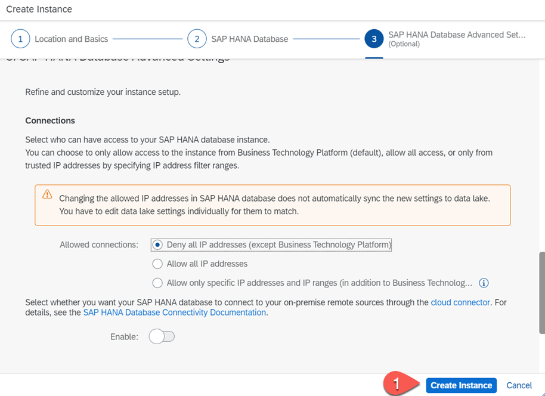

8.  After some minutes the HANA instace is created and you should see a similar card.

    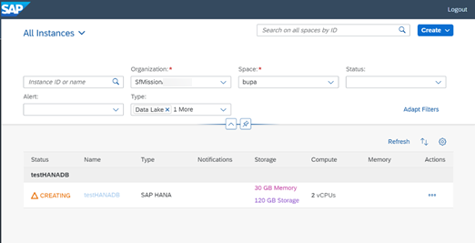

With that the setup of your SAP BTP account is done.
