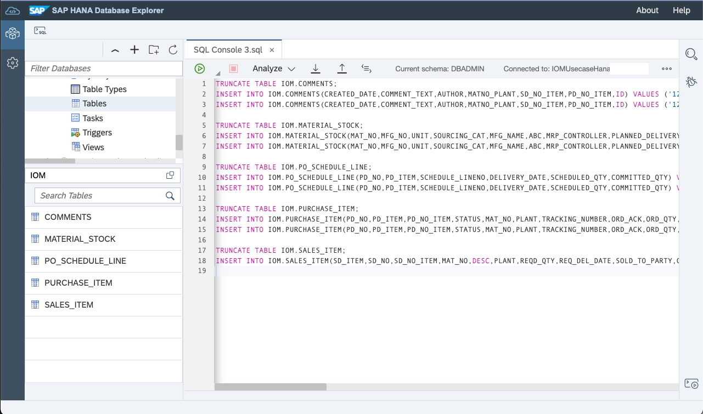
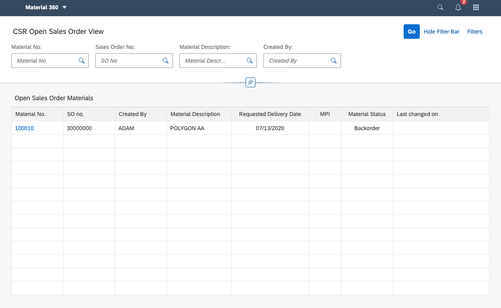

# Configure and Deploy Example Application

## Import Sample Data

* Go to SAP HANA Database Explorer​
* Connect to your DB​
* Open SQL Console​
* Run ./sample-data/create-tables-and-views.sql​
* Run ./sample-data/insert-data.sql



## Run the Backend Server
* Go to the server folder
  * cd server
* Open dbconnection.js in any editor and do following modification
```
  var host = {
    host     : '<DB_HOST_URL>',
    port     : 443,
    user     : 'DBADMIN',
    password : '<DB_PASSWORD>',
    ca: undefined
  }
```
* Test locally
  * npm install
  * npm start
  * Test http://localhost:3000
```json
{
  "data": "This is IOM data API"
}
```
  * Test http://localhost:3000/csr
```json
[
  {
    "(SD_NO_ITEM)": "30000000_01",
    "MAT_NO": "100010",
    "PLANT": "999",
    "SD_NO": "30000000",
    "CREATED_BY": "ADAM",
    "MAT_DESC": "POLYGON AA",
    "REQ_DEL_DATE": "20200713",
    "MPI": null,
    "MAT_STATUS": "Backorder",
    "FLAG_ACK": null,
    "FLAG_TRACK": null,
    "FLAG_EXP": null,
    "ESCALATION_STATUS": null,
    "COMMENT_TEXT": "Improved date not possible",
    "CREATED_DATE": "12/18/2020, 17:24:16",
    "LAST_MODIFIED": null
  }
]
```
  * Test http://localhost:3000/sme
```json
[
  {
    "(PD_NO_ITEM)": "4000000000_01",
    "MAT_NO": "100012",
    "PLANT": "999",
    "PD_NO": "4000000000",
    "MAT_DESC": "POLYGON BB",
    "CREATED_ON": "20200713",
    "DELIVERY_DATE": "20200727",
    "MAT_STATUS": "Backorder",
    "FLAG_ACK": null,
    "FLAG_TRACK": null,
    "FLAG_EXP": null,
    "MPI": null,
    "ABC": "A",
    "ESCALATION_STATUS": null,
    "COMMENT_TEXT": null,
    "CREATED_DATE": null,
    "SCHEDULE_LINENO": "1"
  },
  {
    "(PD_NO_ITEM)": "4000000000_02",
    "MAT_NO": "100010",
    "PLANT": "999",
    "PD_NO": "4000000000",
    "MAT_DESC": "POLYGON AA",
    "CREATED_ON": "20200713",
    "DELIVERY_DATE": "20200727",
    "MAT_STATUS": "Backorder",
    "FLAG_ACK": null,
    "FLAG_TRACK": null,
    "FLAG_EXP": null,
    "MPI": null,
    "ABC": "A",
    "ESCALATION_STATUS": null,
    "COMMENT_TEXT": null,
    "CREATED_DATE": null,
    "SCHEDULE_LINENO": "1"
  }
]
```
* Deploy to Cloud Foundry
  * cf login (Skip when you are logged in)
    * Enter your SAP BTP Cloud Foundry credentials
  * cf push
* Test on SAP BTP
  * Go to SAP BTP Cockpit
  * Go to your subaccount
  * Go to your space
  * Go to Applications
  * Go to "iom-server"
  * Click the link of "Application Routes"
  * Test the link
  * Test the link + /csr
  * Test the link + /sme

# Run the Frontend Application


* Test locally
  * Open terminal and go to the server folder
    * cd ../server
  * Run the local server
    * npm start
    * Keep open
  * Modify "serverUrl" on webapp/index.html
```
    var serverUrl = 'http://localhost:3000';
```
* Open another terminal and go to the ui folder
  * cd ui
  * npm install
  * npm start
  * Test "Material 360" > "CSR View"
  * Test "Material 360" > "Buyer View"
* Build the production distribution
  * Go to SAP BTP Cockpit
  * Go to your subaccount
  * Go to your space
  * Go to Applications
  * Go to "iom-server"
  * Copy the link of "Application Routes" of the backend server
  * Modify "serverUrl" on webapp/index.html
```
    var serverUrl = '<BACKEND_SERVER_APPLICATION_ROUTE>';
```
  * Build the production distribution on terminal that is pointing to ui
    * npm run build
* Deploy to Cloud Foundry
  * cf login (Skip when you are logged in)
    * Enter your SAP BTP Cloud Foundry credentials
  * cf push
* Test on SAP BTP
  * Go to SAP BTP Cockpit
  * Go to your subaccount
  * Go to your space
  * Go to Applications
  * Go to "iom"
  * Click the link of "Application Routes"
  * Test "Material 360" > "CSR View"
  * Test "Material 360" > "Buyer View"


